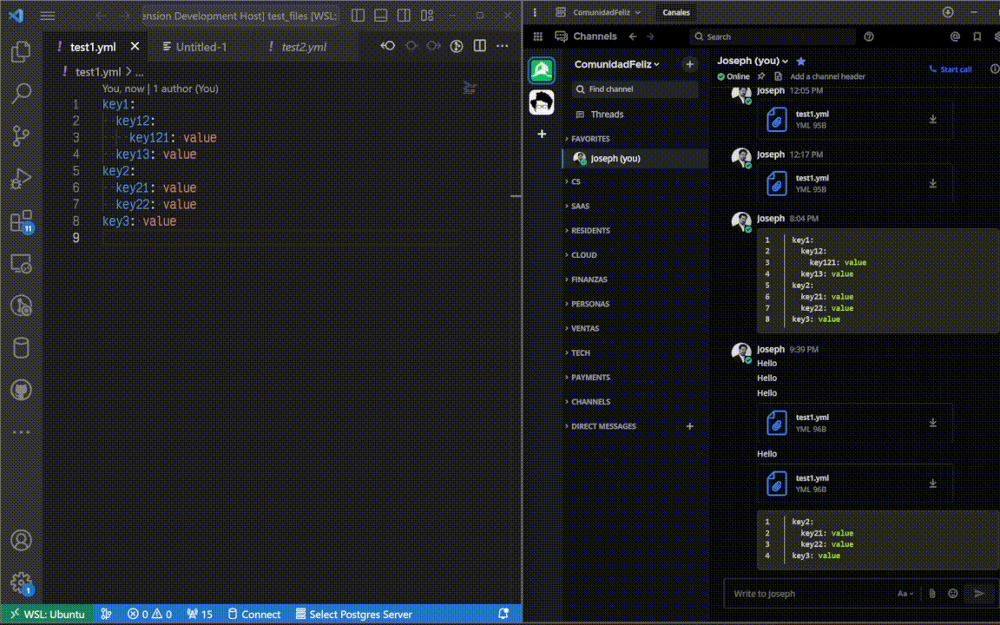
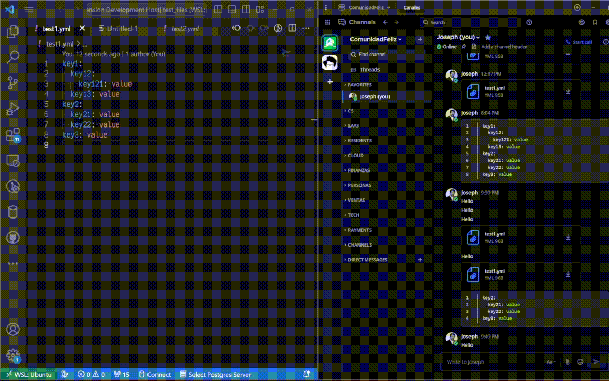
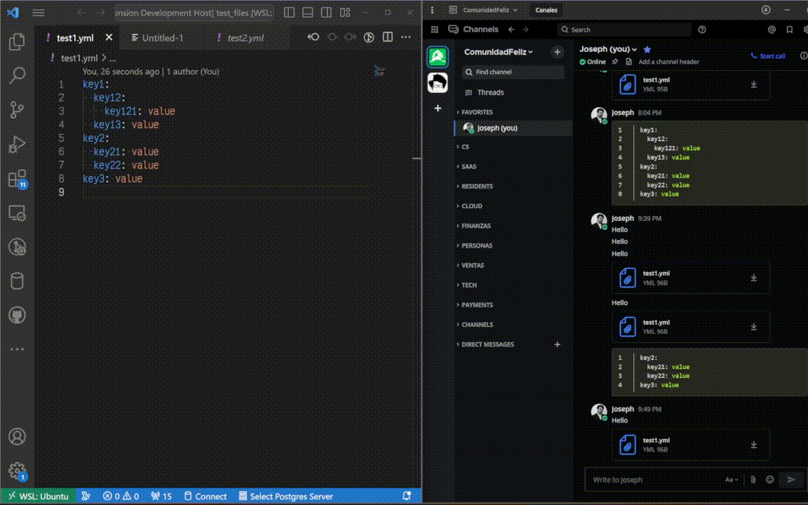

# mattermost-chat README

Extension for Mattermost communication.

## Features

* Send message to
  * User
  * Channel

* Send file to
  * User
  * Channel

* Send snippet to
  * User
  * Channel

## Extension Settings

* `mattermostChat.token`: Your token to connect to your server. You can set this manually or login on your first interaction with the extension.
* `mattermostChat.server`: The URL to your Mattermost server. You can set this manually or login on your first interaction with the extension.

## Known Issues

This extension doesn't validate inputs (length or file size).

## Release Notes

### 0.0.1

Initial release of Mattermost Chat
